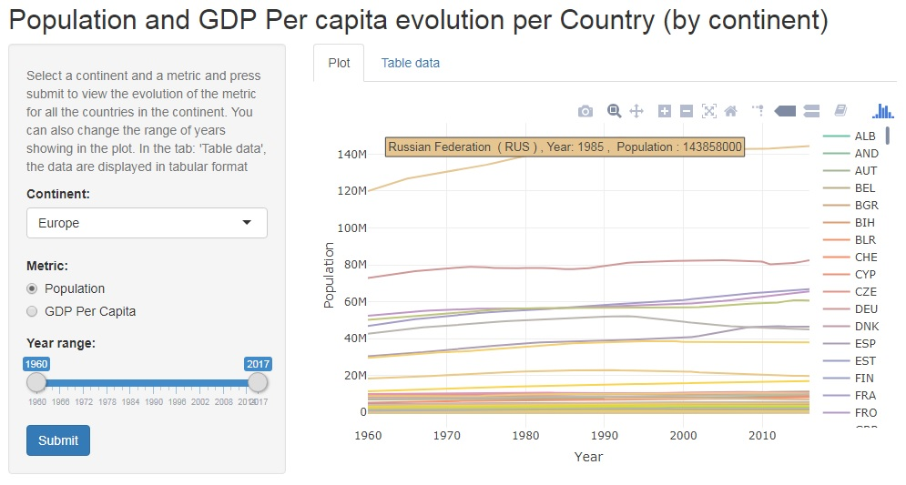

```{r setup, include=FALSE}
knitr::opts_chunk$set(echo = FALSE)
library(reshape)
```

## My Shiny application

As part of the final assignment of the Coursera Course:"Developing Data Products" I developed an interactive "Shiny" app.

The app can be viewed here:
<https://gpapac.shinyapps.io/gpap_devdataproducts_week4_app/>

This app enables us to select a continent and explore the annual population and GDP per capita data for the countries in this continent for the years between 1960 and 2017 (although the data for some countries are missing for some years)

The following data sources were used in this app:

* Population, total from world bank <https://data.worldbank.org/indicator/SP.POP.TOTL>
* GDP per capita (current US$) from world bank <https://data.worldbank.org/indicator/NY.GDP.PCAP.CD>
* A list of country codes and their corresponding continent 

## Screenshot of the Shiny application



## About the implementation

The library **Plotly** was used for the plots because it has a rich interactive interface.
The data were all downloaded as  CSV files.

```{r echo = FALSE}
  countries_population<-read.csv("E:/GPAPAC_Files/Study/Coursera/09.DevelopingDataProducts/Week4Assignment/GPAP_DevDataProducts_Week4_App/API_SP.POP.TOTL_DS2_en_csv_v2_9908626.csv",stringsAsFactors=FALSE, skip = 4, header = T, dec=".")
  countries_population <- countries_population[, -which(names(countries_population)=="Indicator.Name")]
  countries_population <- countries_population[, -which(names(countries_population)=="Indicator.Code")]
```
Because in these files the data for each year are in different columns, in order to plot the data, we use the **melt** function of the **reshape** library (which "transposes" the data) and then create an additional "year" column:

```{r echo = TRUE}
  countries_population <- melt(countries_population, c("Country.Code", "Country.Name"))
  countries_population$year <- as.numeric(substr(as.character(countries_population$variable), 2, 20))

  str(countries_population)

```

## Some interesting views

From this interactive plot, we can see many interesting things, some known and others not so much, for example:

* The largest on the earth and ever increasing populations of China and India in Asia as well as the polulation of Japan that decreases the last few years.
* The famous richest countries in Europe (with the largest GDP per capita)
* The fact that Bermuda is the country with the highest GDP per capita in North America
* The large increase in the population of Nigeria in Africa for the last decades

**Thank you**